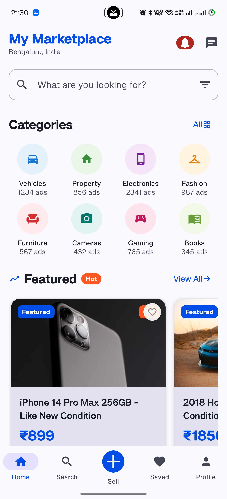
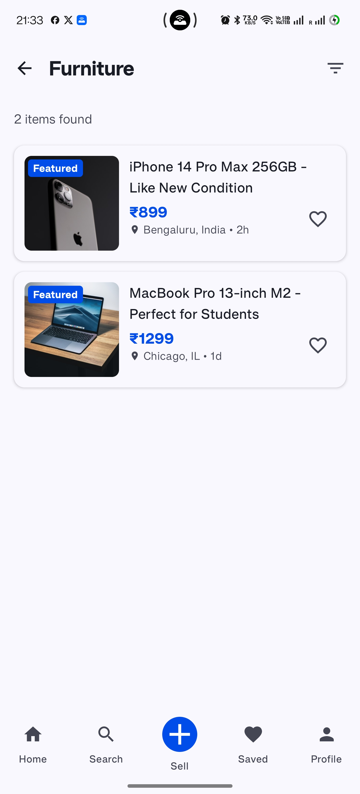
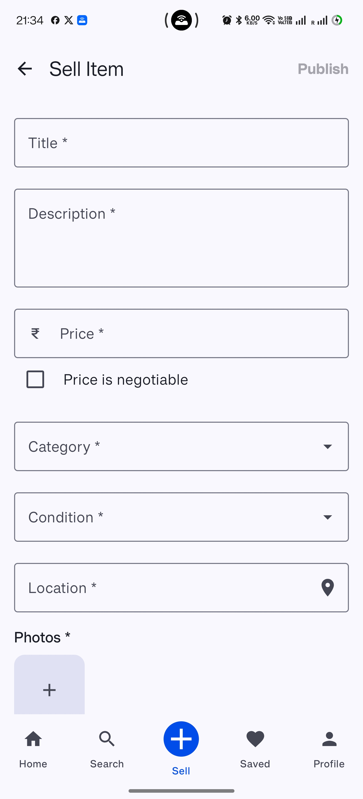
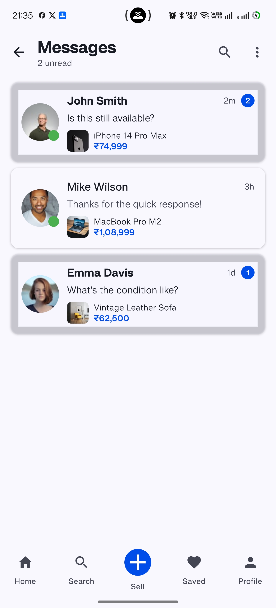
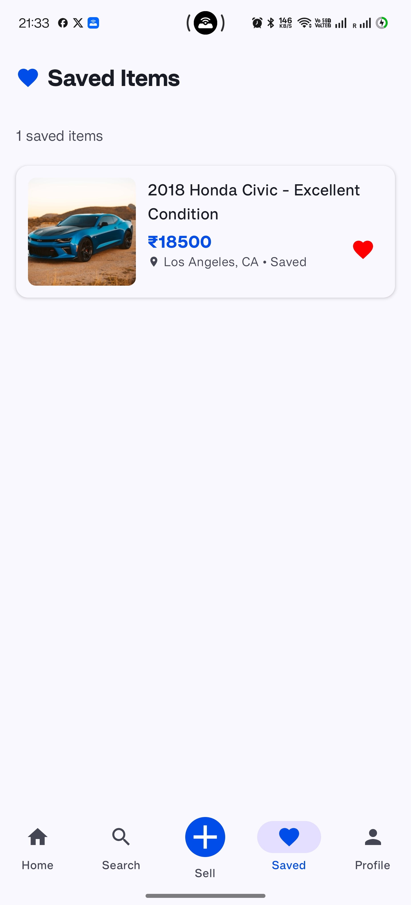
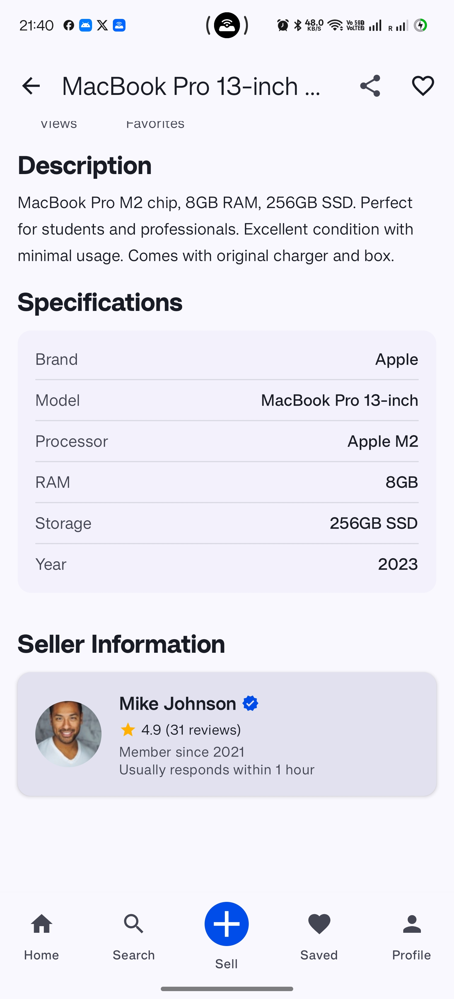
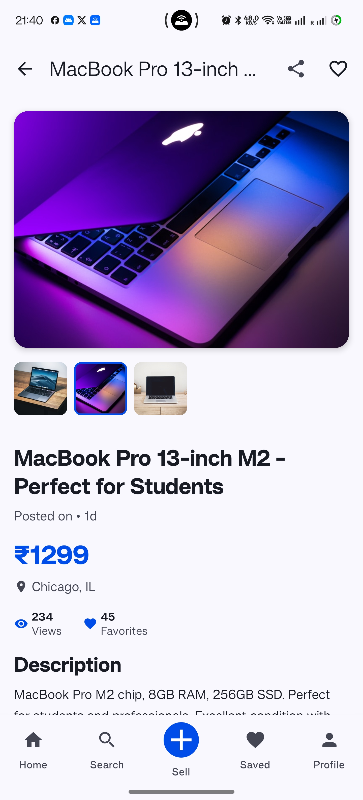

# MyMarketplace - Modern Android Marketplace App

<p align="center">
  
</p>

<p align="center">
  <b>A modern, feature-rich marketplace app built with Jetpack Compose and Clean Architecture</b>
</p>

## 📱 Overview

MyMarketplace is a fully-featured OLX-style marketplace Android application that allows users to browse, search, and list items for sale. Built with modern Android development practices, this app showcases advanced UI implementation with Jetpack Compose, Clean Architecture principles, and the latest Material 3 design system.

> **⚠️ DEVELOPMENT STATUS DISCLAIMER**  
> This application is currently under active development. Some features described in this README may be partially implemented or planned for future releases. The codebase structure, UI components, and functionality are subject to change as development progresses. This project serves as a demonstration of modern Android development practices and architectural patterns.

## 📸 Screenshots

<p align="center">
  
  
  
  
  
  
  
</p>

## ✨ Features

- **Modern UI with Jetpack Compose**
  - Material 3 design system with dynamic theming
  - Smooth animations and transitions
  - Responsive layouts for all screen sizes

- **Comprehensive Home Screen**
  - Featured items carousel
  - Categories grid with custom icons
  - Trending items section
  - Recently viewed items

- **Advanced Search Functionality**
  - Filter by category, price range, and condition
  - Sort by relevance, price, or date
  - Save search preferences

- **Detailed Item View**
  - Image gallery with zoom support
  - Seller information and ratings
  - Item specifications and condition
  - Location map integration

- **Sell Screen with Form Validation**
  - Multi-step listing process
  - Image upload from camera or gallery
  - Location selection with Google Maps integration
  - Comprehensive form validation

- **Chat System**
  - Real-time messaging between buyers and sellers
  - Message status indicators
  - Media sharing capabilities

- **User Profile**
  - Personal information management
  - Listings management
  - Wishlist and saved searches

- **Additional Features**
  - Dark mode support
  - Offline capability with local caching
  - Push notifications for messages and offers
  - Share listings via social media

## 🏗️ Architecture

MyMarketplace follows Clean Architecture principles with a clear separation of concerns:

- **Domain Layer**: Contains business logic, models, and use cases
- **Data Layer**: Handles data operations, repositories, and external APIs
- **Presentation Layer**: UI components, ViewModels, and state management

### Key Components

- **MVVM Pattern**: ViewModels manage UI state and business logic
- **Repository Pattern**: Single source of truth for data operations
- **Use Cases**: Encapsulate specific business rules
- **Dependency Injection**: Using Hilt for clean, testable code
- **Reactive Programming**: Using Kotlin Flow for reactive data streams

## 🛠️ Tech Stack

- **Kotlin**: 100% Kotlin codebase with Coroutines and Flow
- **Jetpack Compose**: Modern declarative UI toolkit
- **Material 3**: Latest Material Design components and theming
- **Navigation Compose**: Type-safe navigation between screens
- **Hilt**: Dependency injection for Android
- **Retrofit & OkHttp**: Network communication
- **Room**: Local database for offline caching
- **Coil**: Image loading and caching
- **Google Maps**: Location services integration
- **Accompanist**: Compose UI utilities
- **MockK & JUnit**: Testing frameworks

## 📋 Project Structure

```
app/
├── src/
│   ├── main/
│   │   ├── java/com/androstark/marketplace/
│   │   │   ├── data/                   # Data layer
│   │   │   │   ├── api/                # API services
│   │   │   │   ├── db/                 # Room database
│   │   │   │   ├── model/              # Data models
│   │   │   │   └── repository/         # Repository implementations
│   │   │   ├── di/                     # Dependency injection modules
│   │   │   ├── domain/                 # Domain layer
│   │   │   │   ├── model/              # Domain models
│   │   │   │   ├── repository/         # Repository interfaces
│   │   │   │   └── usecase/            # Business logic use cases
│   │   │   └── presentation/           # Presentation layer
│   │   │       ├── common/             # Shared UI components
│   │   │       ├── home/               # Home screen
│   │   │       ├── details/            # Item details screen
│   │   │       ├── sell/               # Sell screen
│   │   │       ├── chat/               # Chat screen
│   │   │       ├── search/             # Search screen
│   │   │       ├── profile/            # Profile screen
│   │   │       └── navigation/         # Navigation components
│   │   └── res/                        # Resources
│   └── test/                           # Unit tests
└── build.gradle                        # App-level build file
```

## 🚀 Getting Started

### Prerequisites
- Android Studio Arctic Fox or newer
- JDK 11 or higher
- Android SDK 31 or higher

### Installation
1. Clone the repository
   ```bash
   git clone https://github.com/Pritish9124/my_marketplace.git
   ```
2. Open the project in Android Studio
3. Sync Gradle files
4. Run the app on an emulator or physical device
```

## 📄 License

This project is licensed under the MIT License - see the [LICENSE](LICENSE) file for details.

## 👨‍💻 About Me

I'm a mobile app developer with 7+ years of experience in Android and Flutter development. Apart from building modern, scalable mobile applications, I also have a strong foundation in low-level Android development — having been an active custom ROM developer and contributor on the XDA Developers Forum.

### Connect with me:
- [GitHub](https://github.com/Pritish9124)
- [LinkedIn](https://www.linkedin.com/in/pritish-priyadarshan-sahoo-558385159/)
- [XDA](https://xdaforums.com/m/pritish-sahoo.5730719/about)

---

<p align="center">
  Made with ❤️ by Your Name
</p>
